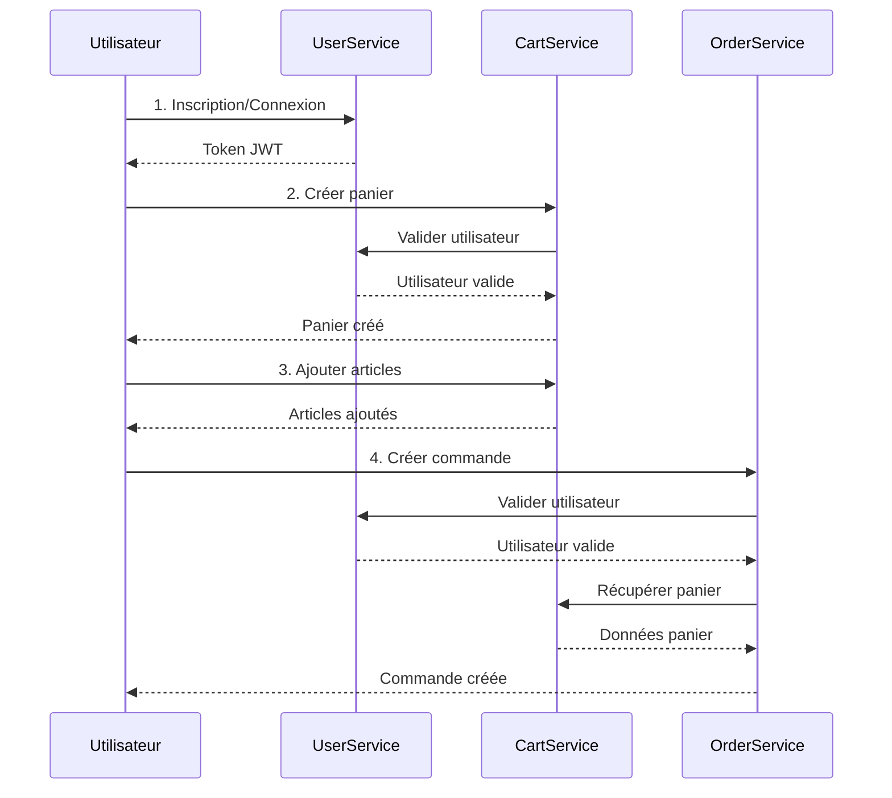
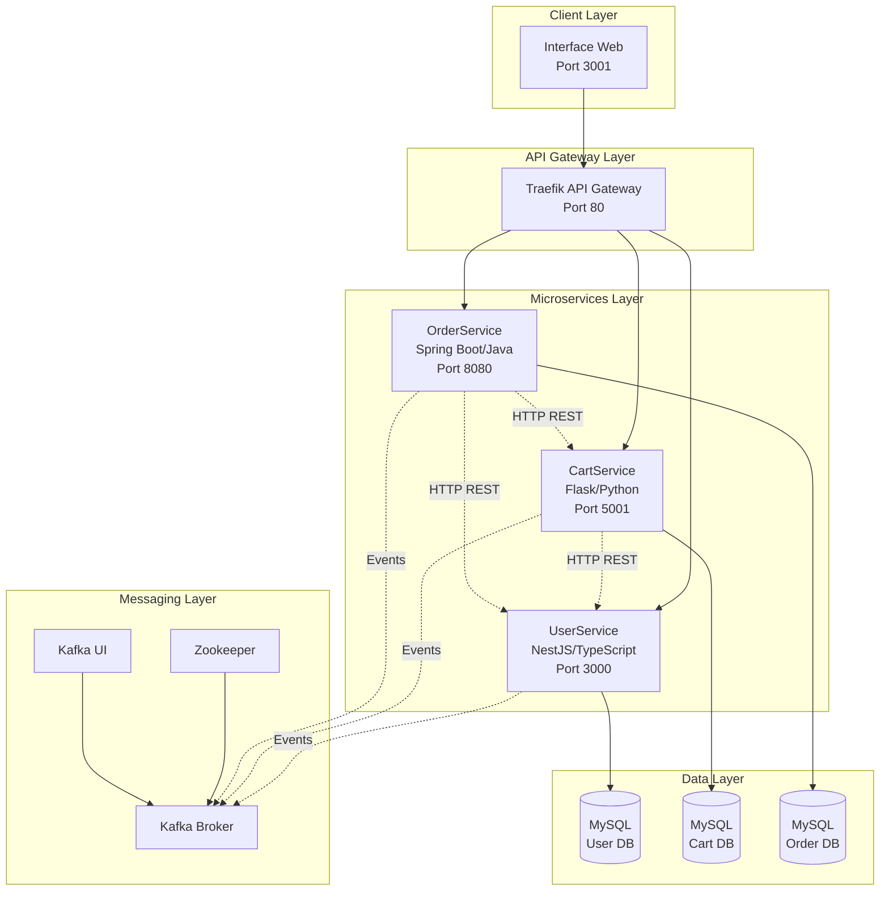
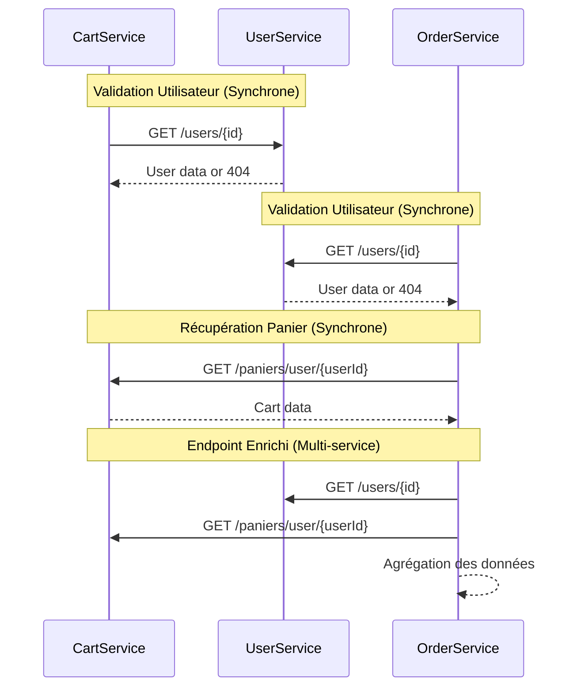
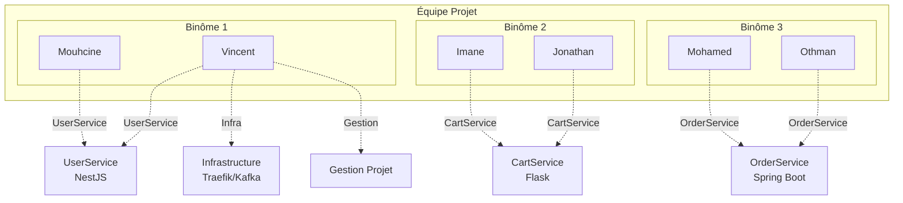

# Architecture Microservices E-Commerce

## Présentation de Projet

---

## Table des Matières

1. [Vue d'Ensemble de l'Application](#1-vue-densemble-de-lapplication)
2. [Architecture Système](#2-architecture-système)
3. [Justification des Choix Architecturaux](#3-justification-des-choix-architecturaux)
4. [Démonstration de l'Application](#4-démonstration-de-lapplication)
5. [Gestion de Projet et Distribution des Tâches](#5-gestion-de-projet-et-distribution-des-tâches)
6. [Perspective Critique](#6-perspective-critique)

---

## 1. Vue d'Ensemble de l'Application

### 1.1 Contexte du Projet

Dans le cadre de notre formation en architecture logiccielle, nous avons développé une plateforme e-commerce complète basée sur une architecture microservices. Ce projet nous a permis d'appliquer concrètement les principes fondamentaux des systèmes distribués modernes.

L'objectif principal était de construire une application capable de gérer le cycle de vie complet d'un achat en ligne, depuis la création d'un compte utilisateur jusqu'à la validation d'une commande, en passant par la gestion d'un panier d'achat.

### 1.2 Objectifs Pédagogiques

Le projet visait plusieurs objectifs d'apprentissage :

- **Maîtriser l'architecture microservices** : Concevoir et implémenter des services autonomes et faiblement couplés
- **Communication inter-services** : Mettre en œuvre des mécanismes de communication synchrone (REST) et asynchrone (événements)
- **Polyglotte technique** : Développer des services dans différents langages et frameworks
- **Gestion d'infrastructure** : Orchestrer des conteneurs Docker et configurer un API Gateway
- **Bonnes pratiques** : Appliquer les patterns de conception, standardisation des API, et gestion d'erreurs

### 1.3 Fonctionnalités Métier

Notre plateforme e-commerce offre les fonctionnalités suivantes :

**Gestion des Utilisateurs**
- Inscription et authentification sécurisée avec JWT
- Gestion du profil utilisateur
- Contrôle d'accès aux ressources

**Gestion des Paniers**
- Création et gestion de paniers d'achat
- Ajout, modification et suppression d'articles
- Calcul automatique des totaux
- Validation de l'existence des utilisateurs avant création

**Gestion des Commandes**
- Création de commandes depuis un panier
- Gestion du cycle de vie des commandes (statuts)
- Enrichissement des données via agrégation multi-services
- Association automatique avec les utilisateurs

### 1.4 Schéma du Workflow Métier



---

## 2. Architecture Système

### 2.1 Vue d'Ensemble de l'Architecture

Notre système adopte une architecture microservices pure avec séparation stricte des responsabilités. Chaque service est autonome, possède sa propre base de données, et communique avec les autres via des interfaces standardisées.



### 2.2 Description des Microservices

#### UserService (NestJS/TypeScript)

**Responsabilités** :
- Gestion du cycle de vie des utilisateurs (CRUD)
- Authentification et génération de tokens JWT
- Validation des identités pour les autres services

**Technologies** :
- Framework : NestJS (architecture orientée modules)
- Langage : TypeScript (typage fort)
- Base de données : MySQL avec TypeORM
- Sécurité : bcrypt pour le hashing, JWT pour l'authentification

**Endpoints principaux** :
- `POST /auth/register` : Inscription
- `POST /auth/login` : Connexion
- `GET /users` : Liste des utilisateurs
- `GET /users/:id` : Détails d'un utilisateur

**Particularités** :
- Validation des DTO avec class-validator
- Guards pour protéger les routes
- Middleware d'exception standardisé
- Hashing sécurisé des mots de passe (bcrypt, 10 rounds)

#### CartService (Flask/Python)

**Responsabilités** :
- Gestion des paniers d'achat
- Gestion des articles dans les paniers
- Calcul des totaux et sous-totaux
- Validation des utilisateurs via UserService

**Technologies** :
- Framework : Flask (micro-framework Python)
- ORM : SQLAlchemy
- Base de données : MySQL
- Communication : Requests (HTTP client)

**Endpoints principaux** :
- `POST /paniers` : Créer un panier
- `GET /paniers` : Lister les paniers
- `GET /paniers/:id` : Détails d'un panier avec articles
- `GET /paniers/user/:userId` : Paniers d'un utilisateur
- `POST /articles` : Ajouter un article au panier

**Particularités** :
- Validation utilisateur avant création de panier
- Calcul automatique des totaux (ligne et panier)
- Architecture en couches (controllers, services, models)
- Gestion des erreurs standardisée

#### OrderService (Spring Boot/Java)

**Responsabilités** :
- Gestion des commandes
- Gestion des items de commande
- Agrégation de données multi-services
- Validation des utilisateurs via UserService

**Technologies** :
- Framework : Spring Boot 3.x
- Langage : Java 21
- Persistance : Spring Data JPA
- Base de données : MySQL
- Communication : RestTemplate

**Endpoints principaux** :
- `POST /api/orders` : Créer une commande
- `GET /api/orders` : Lister les commandes (avec pagination)
- `GET /api/orders/:id` : Détails d'une commande
- `GET /api/orders/:id/enriched` : Commande enrichie (User + Cart)
- `GET /api/orders/user/:userId` : Commandes d'un utilisateur
- `POST /api/order-items` : Ajouter un item à une commande

**Particularités** :
- Endpoint enrichi démontrant l'agrégation de données
- Clients REST pour UserService et CartService
- Pagination native avec Spring Data
- Gestion d'erreurs avec @ControllerAdvice
- Configuration CORS pour l'intégration frontend

### 2.3 Communication Inter-Services

Notre architecture implémente plusieurs patterns de communication :



**Communication Synchrone (HTTP/REST)** :
- CartService valide l'existence d'un utilisateur avant de créer un panier
- OrderService valide l'existence d'un utilisateur avant de créer une commande
- OrderService récupère les données du panier pour enrichir les commandes

**Communication Asynchrone (Kafka)** :
- Publication d'événements lors d'actions importantes (user.registered, order.created, etc.)
- Architecture orientée événements pour le découplage
- Topics pré-configurés pour chaque type d'événement

### 2.4 Infrastructure et Outils

#### Traefik - API Gateway

**Rôle** :
- Point d'entrée unique pour tous les services
- Routage dynamique basé sur les règles de chemin
- Load balancing automatique
- Découverte de services via Docker labels

**Configuration** :
```yaml
# Exemple de routage pour UserService
traefik.http.routers.user-auth.rule=Host(`localhost`) && PathPrefix(`/api/auth`)
traefik.http.middlewares.user-stripprefix.stripprefix.prefixes=/api
```

**Avantages** :
- Configuration déclarative dans docker-compose
- Pas de fichier de configuration externe
- Dashboard intégré pour le monitoring
- Support HTTPS natif

#### Kafka - Message Broker

**Architecture** :
- Zookeeper pour la coordination du cluster
- Kafka Broker pour le stockage et routage des messages
- Kafka UI pour l'administration et le monitoring

**Topics configurés** :
- `order.created`, `order.updated`, `order.cancelled`
- `payment.pending`, `payment.completed`, `payment.failed`
- `cart.item.added`, `cart.item.removed`, `cart.cleared`
- `user.registered`, `user.updated`

**Configuration** :
- 3 partitions par topic (parallélisation)
- Replication factor de 1 (développement)
- Auto-création désactivée (topics pré-définis)

#### Docker et Orchestration

**Réseau** :
- Réseau bridge externe `microservices-network`
- Isolation des services tout en permettant la communication

**Gestion des dépendances** :
- Healthchecks pour garantir la disponibilité des services
- Ordre de démarrage contrôlé (infrastructure > services > UI)

**Volumes** :
- Persistance des données MySQL
- Hot-reload pour le développement

### 2.5 Patterns Architecturaux Implémentés

**Database per Service** :
- Chaque microservice possède sa propre base de données
- Isolation complète des données
- Autonomie dans le choix du schéma

**API Gateway Pattern** :
- Traefik comme point d'entrée unique
- Routage intelligent vers les services
- Simplification de l'architecture client

**Service Discovery** :
- Découverte automatique via Docker labels
- Pas de configuration statique
- Ajout/retrait de services dynamique

**Circuit Breaker** (prévu) :
- Protection contre les défaillances en cascade
- Timeout et retry configurable

**Saga Pattern** (prévu) :
- Gestion des transactions distribuées
- Compensation en cas d'échec

---

## 3. Justification des Choix Architecturaux

### 3.1 Choix Technologiques par Service

#### UserService - NestJS/TypeScript

**Justification** :
- **TypeScript** : Typage fort pour réduire les erreurs, meilleure maintenabilité
- **NestJS** : Architecture modulaire inspirée d'Angular, injection de dépendances native
- **Écosystème riche** : Intégration native avec TypeORM, JWT, validation
- **Scalabilité** : Architecture orientée modules facilite l'évolution

**Avantages constatés** :
- Code auto-documenté grâce aux types
- Détection d'erreurs à la compilation
- Architecture claire et structurée
- Excellent pour un service critique comme l'authentification

#### CartService - Flask/Python

**Justification** :
- **Simplicité** : Flask est minimaliste et facile à prendre en main
- **Python** : Syntaxe claire, parfait pour la logique métier
- **Flexibilité** : Pas de structure imposée, adaptation au besoin
- **SQLAlchemy** : ORM puissant et mature

**Avantages constatés** :
- Développement rapide
- Code lisible et maintenable
- Grande communauté Python
- Excellente intégration avec les bibliothèques de calcul

#### OrderService - Spring Boot/Java

**Justification** :
- **Écosystème Spring** : Framework d'entreprise complet et éprouvé
- **Java** : Robustesse, performance, typage fort
- **Spring Data JPA** : Abstraction puissante pour la persistance
- **Maturité** : Framework très mature avec beaucoup de documentation

**Avantages constatés** :
- Configuration par annotations simple
- Gestion automatique des transactions
- Pagination et tri intégrés
- Excellent pour un service complexe comme les commandes

### 3.2 Choix d'Infrastructure

#### Traefik comme API Gateway

**Alternatives considérées** :
- Nginx : Configuration statique, moins adapté à Docker
- Kong : Plus complexe, fonctionnalités surdimensionnées pour notre besoin
- Spring Cloud Gateway : Nécessite une JVM dédiée

**Pourquoi Traefik** :
- Configuration dynamique via labels Docker
- Dashboard intégré
- Léger et performant
- Parfait pour les environnements conteneurisés

#### MySQL pour toutes les bases

**Alternatives considérées** :
- PostgreSQL : Excellent mais pas nécessaire pour nos besoins
- MongoDB : NoSQL non adapté à nos relations structurées
- Mix de bases : Complexité inutile à ce stade

**Pourquoi MySQL** :
- SGBD relationnel mature et fiable
- Excellente performance pour nos volumes
- Familiarité de l'équipe
- Support natif par tous nos frameworks
- phpMyAdmin pour l'administration facile

#### Kafka pour la messagerie

**Alternatives considérées** :
- RabbitMQ : Bon mais moins scalable
- Redis Pub/Sub : Trop simple pour nos besoins futurs
- Amazon SQS : Dépendance cloud

**Pourquoi Kafka** :
- Haute performance et scalabilité
- Persistance des messages
- Architecture distribuée native
- Standard de l'industrie
- Parfait pour l'event sourcing futur

### 3.3 Principes Architecturaux

#### Séparation des Responsabilités

Chaque service a un périmètre fonctionnel clair :
- **UserService** : Identité et authentification uniquement
- **CartService** : Gestion de panier uniquement
- **OrderService** : Gestion de commandes uniquement

Cela permet :
- Développement indépendant par équipe
- Déploiement indépendant
- Scalabilité ciblée
- Réduction de la complexité

#### Standardisation des API

Nous avons adopté des standards communs :

**Format de réponse** :
```json
{
  "success": true,
  "data": { ... },
  "error": null
}
```

**Codes HTTP** :
- 200 : Succès
- 201 : Création réussie
- 400 : Erreur de validation
- 401 : Non authentifié
- 404 : Ressource non trouvée
- 500 : Erreur serveur

**Gestion d'erreurs** :
```json
{
  "error": {
    "code": "ERROR_CODE",
    "message": "Message descriptif",
    "details": { ... }
  }
}
```

#### Communication Inter-Services

**Règles adoptées** :
- Communication synchrone pour les validations critiques
- Communication asynchrone pour les notifications et événements
- Timeout de 5 secondes maximum
- Gestion des erreurs avec fallback

#### Sécurité

**Mesures implémentées** :
- Authentification JWT avec expiration (1 heure)
- Hashing bcrypt des mots de passe (10 rounds)
- Validation stricte des entrées
- CORS configuré pour l'origine autorisée
- Isolation réseau via Docker

---

## 4. Démonstration de l'Application

### 4.1 Interface Utilisateur

Nous avons développé une interface web complète pour démontrer toutes les fonctionnalités :

**URL d'accès** : http://localhost:3001

**Fonctionnalités** :
- Inscription et connexion des utilisateurs
- Gestion des profils
- Création et gestion de paniers
- Ajout d'articles aux paniers
- Création et suivi de commandes
- Visualisation des données enrichies

**Technologies** :
- HTML5/CSS3 pour l'interface
- JavaScript vanilla pour l'interactivité
- Nginx comme serveur web
- Docker pour le déploiement

### 4.2 Workflow Complet de Démonstration

#### Étape 1 : Création d'un Utilisateur

**Action** : Inscription via l'interface
```http
POST /auth/register
{
  "email": "alice@example.com",
  "password": "SecurePassword123",
  "firstName": "Alice",
  "lastName": "Martin"
}
```

**Résultat** :
- Utilisateur créé dans la base UserService
- Token JWT généré
- Compte actif immédiatement

#### Étape 2 : Connexion

**Action** : Login via l'interface
```http
POST /auth/login
{
  "email": "alice@example.com",
  "password": "SecurePassword123"
}
```

**Résultat** :
- Token JWT retourné
- Session active pour 1 heure
- Prêt à utiliser les autres services

#### Étape 3 : Création d'un Panier

**Action** : Créer un panier
```http
POST /paniers
{
  "userId": 1,
  "status": "active"
}
```

**Validation inter-service** :
- CartService appelle UserService
- Vérifie que l'utilisateur existe
- Refuse si utilisateur inexistant

#### Étape 4 : Ajout d'Articles

**Action** : Ajouter des articles au panier
```http
POST /articles
{
  "panierId": 1,
  "productId": "LAPTOP-001",
  "quantity": 1,
  "unitPrice": 1299.99
}
```

**Résultat** :
- Article ajouté au panier
- Calcul automatique du total ligne
- Mise à jour du total panier

#### Étape 5 : Création d'une Commande

**Action** : Créer une commande
```http
POST /api/orders
{
  "userId": 1,
  "shippingAddress": "123 Rue de Paris",
  "billingAddress": "123 Rue de Paris",
  "totalAmount": 1299.99,
  "status": "PENDING"
}
```

**Validations inter-services** :
- OrderService valide l'utilisateur (UserService)
- OrderService peut récupérer le panier (CartService)
- Création de la commande si tout est valide

#### Étape 6 : Données Enrichies

**Action** : Récupérer une commande enrichie
```http
GET /api/orders/1/enriched
```

**Agrégation** :
- OrderService récupère les données utilisateur (UserService)
- OrderService récupère les données panier (CartService)
- Combine toutes les données dans une réponse unique

### 4.3 Script de Test Automatisé

Nous avons développé un script de test complet :

**Fichier** : `test-inter-service-communication.sh`

**Ce qu'il teste** :
1. Création d'utilisateurs (UserService)
2. Validation utilisateur lors de création panier (CartService → UserService)
3. Gestion d'articles (CartService)
4. Création de commandes (OrderService → UserService)
5. Récupération de données enrichies (OrderService → UserService + CartService)
6. Health checks de tous les services

**Résultat** :
- Validation complète de la communication inter-services
- Démonstration que chaque service peut récupérer les données des autres
- Preuve du bon fonctionnement de l'architecture

### 4.4 Outils de Monitoring

#### Traefik Dashboard
- **URL** : http://localhost:8090
- **Visualisation** : Routes configurées, services actifs, métriques

#### Kafka UI
- **URL** : http://localhost:8081
- **Visualisation** : Topics, messages, consumer groups

#### phpMyAdmin (par service)
- **UserService** : http://localhost:8083
- **CartService** : http://localhost:8082
- **OrderService** : http://localhost:8084

---

## 5. Gestion de Projet et Distribution des Tâches

### 5.1 Organisation de l'Équipe

Notre équipe de 6 personnes s'est organisée en 3 binômes spécialisés :



### 5.2 Distribution des Responsabilités

#### Binôme 1 : Mouhcine & Vincent - UserService + Infrastructure

**UserService (NestJS/TypeScript)** :
- Architecture NestJS avec modules
- Authentification JWT
- Gestion des utilisateurs (CRUD)
- Validation et sécurité
- API standardisée

**Infrastructure (Vincent)** :
- Configuration Traefik (API Gateway)
- Orchestration Docker Compose
- Configuration Kafka/Zookeeper
- Réseau microservices
- Script de démarrage automatisé

**Gestion Projet (Vincent)** :
- Garant de l'avancement des tâches
- Plannification
- Facilitation & documenation
- Interface communicante trans équipes / professeur

**Livrables** :
- Service d'authentification fonctionnel
- Documentation API UserService
- Infrastructure complète opérationnelle
- Guide de déploiement

#### Binôme 2 : Imane & Jonathan - CartService

**CartService (Flask/Python)** :
- Architecture Flask en couches
- Gestion des paniers
- Gestion des articles
- Communication avec UserService
- Calculs de totaux

**Défis relevés** :
- Intégration HTTP avec UserService
- Gestion des erreurs réseau
- Validation des données utilisateur
- Architecture propre en Python

**Livrables** :
- Service de panier fonctionnel
- Documentation métier CartService
- Tests de communication inter-services
- Endpoints standardisés

#### Binôme 3 : Mohamed & Othman - OrderService

**OrderService (Spring Boot/Java)** :
- Architecture Spring Boot moderne
- Gestion des commandes
- Gestion des items de commande
- Communication avec UserService et CartService
- Endpoint enrichi (agrégation)

**Défis relevés** :
- Intégration multi-services
- Agrégation de données
- Pagination Spring Data
- Gestion des transactions

**Livrables** :
- Service de commandes fonctionnel
- Endpoint enrichi démonstratif
- Documentation technique OrderService
- Tests d'intégration

### 5.3 Méthodologie de Travail

#### Planning en Jalons

Nous avons suivi un planning structuré en 6 jalons :

**Jalon 1 (30/11/2025)** : Architecture Docker prête
- Mise en place de l'infrastructure
- Configuration du réseau
- Templates docker-compose

**Jalon 2 (07/12/2025)** : Services démarrables individuellement
- Chaque équipe peut lancer son service
- Bases de données configurées
- Hot-reload fonctionnel

**Jalon 3 (14/12/2025)** : Schémas de bases de données implémentés
- Modèles de données validés
- Relations définies
- phpMyAdmin configuré

**Jalon 4 (21/12/2025)** : Microservices terminés
- APIs complètes
- Tests unitaires
- Documentation par service

**Jalon 5 (28/12/2025)** : Intégration complète
- Communication inter-services fonctionnelle
- Tests d'intégration réussis
- Documentation globale

**Jalon 6 (04/01/2026)** : Présentation finale
- Slides de présentation
- Documentation architecturale
- Interface de démonstration

#### Outils de Collaboration

**GitHub** :
- Repository central partagé
- Branches par fonctionnalité
- Pull requests pour code review
- Issues pour le suivi des tâches

**Documentation** :
- README.md global
- Documentation par service
- Guides techniques (Traefik, Kafka)
- Documentation métier

**Communication** :
- Réunions hebdomadaires
- Points d'avancement par binôme
- Revues de code collectives
- Validation des choix techniques ensemble

### 5.4 Standardisation et Bonnes Pratiques

Pour garantir la cohérence entre les services, nous avons établi des standards communs :

[Standards](./standardisation_api_rest.md)

**Documentation** :
- README par service
- Documentation API (endpoints, payloads, réponses)
- Schémas de base de données commentés
- Guides d'utilisation

---

## 6. Perspective Critique

### 6.1 Apprentissages Techniques

#### Architecture Microservices

**Ce que nous avons compris** :
- L'importance de la séparation des responsabilités
- La complexité inhérente aux systèmes distribués
- Les compromis entre autonomie et cohérence

**Difficultés rencontrées** :
- Gestion de la cohérence des données entre services
- Debugging des erreurs inter-services
- Le manque de standards

**Solutions apportées** :
- Logs structurés et centralisés
- Script de test automatisé
- Document commun sur les standards à repsecter

#### Communication Inter-Services

**Ce que nous avons appris** :
- La différence entre communication synchrone et asynchrone
- L'importance des timeouts et retry
- La gestion des erreurs réseau

**Challenges** :
- Gérer les services indisponibles
- Éviter les boucles infinies
- Maintenir la cohérence des données

**Améliorations futures** :
- Implémenter un circuit breaker
- Ajouter du caching pour réduire les appels
- Mettre en place un service mesh (Istio)

#### Polyglotte Technologique

**Avantages constatés** :
- Choisir la meilleure technologie par use case
- Diversité des compétences dans l'équipe
- Apprentissage de plusieurs écosystèmes

**Inconvénients** :
- Complexité de maintenance accrue
- Standards différents par langage
- Courbe d'apprentissage importante

**Leçon** :
Le polyglottisme est puissant mais doit être justifié. Pour un projet en production, nous aurions peut-être limité à 2 technologies principales. Sinon le risque de dette technique augmenterait significativement.

### 6.2 Gestion de Projet

#### Points Positifs

**Organisation en binômes** :
- Facilite la collaboration
- Partage des connaissances
- Code review naturel

**Planning en jalons** :
- Objectifs clairs et mesurables
- Avancement visible
- Détection précoce des problèmes

**Standardisation** :
- Cohérence entre les services
- Intégration facilitée
- Documentation uniforme

#### Difficultés Rencontrées

**Coordination inter-équipes** :
- Synchronisation des interfaces
- Gestion des dépendances entre services
- Communication des changements

**Solutions adoptées** :
- Réunions d'équipe régulières (à chaque pré et post Jalon)
- Documentation des contrats d'API
- Tests d'intégration systématiques (le script inter service)

**Gestion du temps** :
- Sous-estimation de certaines tâches
- Debugging inter-services chronophage
- Intégration finale complexe (mais facilité par notre standarisation précause)

**Amélioration pour la suite** :
- Buffers de temps plus importants
- Tests d'intégration plus tôt
- Mock des services pour développer en parallèle

### 6.3 Choix Techniques Rétrospectifs

#### Ce qui a bien fonctionné

**Traefik comme API Gateway** :
- Configuration simple et dynamique
- Logs très utile
- Parfait pour Docker

**Docker Compose pour l'orchestration** :
- Démarrage simplifié
- Isolation des services
- Reproductibilité forte

**Kafka pour la messagerie** :
- Infrastructure prête pour l'event sourcing
- Scalabilité native
- Monitoring via Kafka UI

#### Ce que nous ferions différemment

**Tests** :
- Mettre en place des tests d'intégration plus tôt
- Automatiser les tests dans une CI/CD
- Utiliser des outils comme Postman/Newman/Insomnia (bibliothèque tests d'API)

**Monitoring** :
- Ajouter Prometheus/Grafana dès le début
- Logs centralisés avec ELK
- Alerting automatisé

**Sécurité** :
- Authentification entre services (mTLS) et identity provider
- Scan de vulnérabilités des images Docker

### 6.4 Retours d'Expérience par Équipe

#### Équipe UserService

**Points forts** :
- NestJS excellent pour l'architecture
- TypeScript élimine beaucoup d'erreurs
- Documentation TypeScript très complète

**Leçons** :
- L'authentification JWT est plus complexe qu'il n'y paraît
- La sécurité doit être pensée dès le début
- Les Guards NestJS sont très puissants

#### Équipe CartService

**Points forts** :
- Flask simple et efficace
- Python excellent pour la logique métier
- SQLAlchemy très puissant

**Leçons** :
- Gérer les erreurs réseau est critique
- La validation des données est essentielle
- L'architecture en couches améliore la maintenabilité (SRP)

#### Équipe OrderService

**Points forts** :
- Spring Boot très complet
- Spring Data facilite énormément la persistance
- Écosystème Java très riche

**Leçons** :
- L'agrégation multi-services nécessite une bonne gestion d'erreurs
- La pagination est essentielle pour de grandes quantités de données
- Les annotations Spring sont très puissantes mais peuvent être complexes

### 6.5 Perspectives d'Évolution

#### Court Terme (1-3 mois)

**Fonctionnalités** :
- Ajout d'un service de paiement
- Service de notification (email/SMS)
- Historique des commandes
- Recherche de produits et catalogue

**Technique** :
- CI/CD complet (GitHub Actions, Gitlab CI)
- Tests automatisés
- Monitoring avancé (Prometheus/Grafana)
- Documentation OpenAPI/Swagger

#### Moyen Terme (3-6 mois)

**Architecture** :
- Event Sourcing complet
- CQRS pour les lectures
- Caching distribué (Redis)

**Sécurité** :
- OAuth2/OIDC
- Vault pour les secrets
- Scan de sécurité automatisé

#### Long Terme (6-12 mois)

**Scalabilité** :
- Migration vers Kubernetes ou Docker Swarm
- Auto-scaling horizontal
- CDN pour le frontend

**Intelligence** :
- Recommandations de produits (ML)
- Détection de fraude
- Analytics avancés
- Canary release

### 6.6 Conclusion

Ce projet nous a permis de comprendre concrètement les enjeux de l'architecture microservices :

**Avantages confirmés** :
- Autonomie des équipes
- Scalabilité ciblée
- Résilience accrue
- Flexibilité technologique

**Complexités découvertes** :
- Gestion de la cohérence distribuée
- Debugging inter-services
- Overhead opérationnel
- Courbe d'apprentissage

**Compétences acquises** :
- Design d'API REST
- Communication inter-services
- Orchestration Docker
- Travail en équipe distribuée
- Documentation technique

---

## Annexes

### Annexe A : Stack Technique Complète

| Composant | Technologie | Version | Rôle |
|-----------|-------------|---------|------|
| API Gateway | Traefik | 3.0 | Routage et reverse proxy |
| UserService | NestJS | 10.x | Authentification et gestion utilisateurs |
| CartService | Flask | 3.x | Gestion des paniers |
| OrderService | Spring Boot | 3.x | Gestion des commandes |
| Message Broker | Kafka | 7.3.0 | Communication asynchrone |
| Coordination | Zookeeper | 7.3.0 | Coordination Kafka |
| Bases de données | MySQL | 8.0 | Persistance des données |
| Conteneurisation | Docker | 24.x | Isolation et déploiement |
| Orchestration | Docker Compose | 2.x | Gestion multi-conteneurs |
| UI | HTML/CSS/JS | - | Interface de démonstration |

### Annexe B : Métriques du Projet

**Lignes de code** :
- UserService : ~2000 lignes (TypeScript)
- CartService : ~1500 lignes (Python)
- OrderService : ~2500 lignes (Java)
- Infrastructure : ~800 lignes (YAML/Shell)
- UI : ~600 lignes (HTML/CSS/JS)

**Documentation** :
- 8 fichiers de documentation
- ~5000 lignes de documentation
- Guides techniques détaillés
- Documentation API complète

**Tests** :
- Script de test inter-services
- Validation de 15+ scénarios
- Couverture des cas d'erreur

### Annexe C : Ressources et Références

**Documentation officielle** :
- NestJS : https://docs.nestjs.com
- Spring Boot : https://spring.io/projects/spring-boot
- Flask : https://flask.palletsprojects.com
- Traefik : https://doc.traefik.io
- Kafka : https://kafka.apache.org/documentation

**Patterns et bonnes pratiques** :
- Microservices Patterns (Chris Richardson)
- Building Microservices (Sam Newman)
- Domain-Driven Design (Eric Evans)

**Outils** :
- Docker : https://docs.docker.com
- Docker Compose : https://docs.docker.com/compose

---

**Date de présentation** : Janvier 2026
**Formation**: Master SIGLIS M2 (Anglet, France)
**Équipe** : Mouhcine, Vincent, Imane, Jonathan, Mohamed, Othman  
**Projet** : Architecture Microservices E-Commerce
