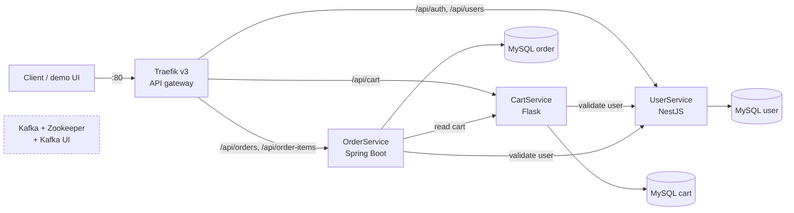

# Microservices — distributed e-commerce platform

> A polyglot e-commerce platform (NestJS, Flask, Spring Boot) behind a Traefik API gateway with JWT authentication, built as a team project to practice distributed architecture.

> **Team project.** Several two-person teams each owned a service. **My role: designer.** I framed the problems and requirements and decided the *why* and the *how* of the architecture. In the service split I worked on the **UserService** (with a teammate) and the **Traefik API gateway**.

<!-- TODO Vincent : add a screenshot of the demo UI (ui/) or of the Traefik dashboard. -->

**Status:** <!-- TODO Vincent : confirm status (stable | archived). ROADMAP.md sets the final presentation for 2026-01-15; last commits Apr 2026. --> — **License:** MIT

| Service | Stack | Owners |
|---|---|---|
| UserService | NestJS / TypeScript | Mouhcine & Vincent |
| CartService | Flask / Python | Imane & Jonathan |
| OrderService | Spring Boot / Java | Mohamed & Othman |
| API gateway (Traefik) | Traefik v3 | Vincent |

---

## 1. Why this project exists

- **Problem:** learn by building what a monolith hides: independent services in different languages that must still behave as one product (shared identity, cross-service calls, one entry point).
- **Who it's for:** a training project, with its architecture justification kept in [`PRESENTATION.md`](PRESENTATION.md) (in French) and a milestone plan in [`ROADMAP.md`](ROADMAP.md).
- **Intent:** a working platform started with one command, where users register, get a JWT, fill a cart and place an order, and where every service can be developed and tested on its own.

### What is implemented

- **UserService:** user CRUD, JWT register/login, bcrypt password hashing, DTO validation.
- **CartService:** carts and articles, with user validation through UserService.
- **OrderService:** orders and order items with statuses and pagination; validates users through UserService and reads carts from CartService; an enriched endpoint aggregates data from several services.
- **Gateway and infrastructure:** Traefik routing by path prefix, one MySQL database and one phpMyAdmin per service, Kafka + Zookeeper + Kafka UI, a demo web UI (`ui/`).

## 2. Architecture & technical choices



All services share the Docker network `microservices-network`. Kafka is provisioned with pre-created topics (`order.*`, `payment.*`, `cart.*`, `user.*`, see [`docs/KAFKA_GUIDE.md`](docs/KAFKA_GUIDE.md)), but **no service produces or consumes events yet**: it is infrastructure ready for the asynchronous part. The circuit breaker and saga patterns are listed as planned in `PRESENTATION.md`, not implemented.

| Decision | Why | Alternative considered |
|---|---|---|
| Traefik as API gateway | Dynamic configuration through Docker labels, built-in dashboard, light | Nginx (static config), Kong (oversized for the need), Spring Cloud Gateway (needs a dedicated JVM) |
| Database per service | Data isolation and independent schemas | — <!-- TODO Vincent : shared database was not discussed in the docs --> |
| Polyglot services: NestJS, Flask, Spring Boot | Each team works in a stack suited to its service: typed, modular NestJS for identity; light Flask for carts; Spring for the more complex order domain | — <!-- TODO Vincent : add the real reason for imposing three stacks --> |
| MySQL for all databases | Mature relational DBMS, team familiarity, native support in all three frameworks, phpMyAdmin for administration | PostgreSQL (not needed), MongoDB (relations are structured), mixed databases (needless complexity) |
| JWT issued by UserService, bcrypt for passwords | Stateless authentication; configurable salt rounds | — |
| Synchronous REST between services | Simple to test with scripts; user and cart checks are request-time | — <!-- TODO Vincent : why REST before Kafka for these calls --> |
| Kafka as message broker (provisioned) | Throughput, message persistence, event-sourcing path | RabbitMQ (less scalable), Redis Pub/Sub (too simple), Amazon SQS (cloud dependency) |
| Common REST conventions ([`standardisation_api_rest.md`](standardisation_api_rest.md)) | Same response envelope and status codes across three stacks | — |

**Stack:** NestJS + TypeORM, Flask + SQLAlchemy, Spring Boot + JPA, MySQL, Traefik v3, Kafka (Confluent 7.3), Docker Compose.

**Repository layout:**
```
UserService/   # NestJS app in app/src (auth, entities, dto), db-init, docker-compose
CartService/   # Flask app in app/ (controllers, services, models, utils)
OrderService/  # Spring Boot (controller, service, client, repository, entity, dto)
ui/            # demo web UI served behind Traefik
docs/          # technical, business, Traefik, Kafka and verification guides
docker-compose.yml   # shared infrastructure: Traefik, Kafka, Zookeeper, Kafka UI, ui
microservices.sh     # start | stop | restart | status | logs | build | clean
```

**Quality:** API test scripts per endpoint (`test-api-*.sh`) with a `run-all-tests.sh` per service and at the root, an end-to-end script for cross-service calls ([`test-inter-service-communication.sh`](test-inter-service-communication.sh), [guide](docs/INTER_SERVICE_COMMUNICATION.md)), plus a small number of framework tests (UserService unit and e2e specs, one Spring context test). No CI workflow in this repository.

More: [technical documentation](docs/TECHNICAL_DOCUMENTATION.md), [business documentation](docs/BUSINESS_DOCUMENTATION.md), [Traefik guide](docs/TRAEFIK_GUIDE.md), [Kafka guide](docs/KAFKA_GUIDE.md), [verification guide](docs/VERIFICATION_GUIDE.md), and one README per service.

## 3. Quickstart

**Prerequisites:** Docker and Docker Compose (the scripts call `docker-compose`), and free local ports (80, 443, 3000, 3001, 5001, 8080 to 8084, 3307 to 3309, 8090).

```bash
git clone https://github.com/vincent-agi/microservices.git
cd microservices

# Configuration: the .env files are not tracked. Copy the templates and fill in
# local development values (never commit real secrets).
cp UserService/.env.example UserService/.env
cp OrderService/.env.example OrderService/.env
cp CartService/.env.example CartService/.env

./microservices.sh start      # infrastructure, then the three services
./microservices.sh status
./test-inter-service-communication.sh   # end-to-end check across services
```

Notes on the `.env` values:
- `DB_HOST` is the database container name on the Docker network: `user-db` for UserService, `order-db` for OrderService, `db` for CartService.
- UserService also needs a `JWT_SECRET` (use a long random value), `JWT_EXPIRATION` and `BCRYPT_SALT_ROUNDS`.
- `DB_USER`, `DB_PASSWORD` and `DB_NAME` are interpolated by the UserService and OrderService compose files, so they must be set before `start`.

Through the gateway: `http://localhost/api/users`, `/api/auth`, `/api/cart`, `/api/orders`. Other commands: `./microservices.sh stop | restart | logs [service] | build | clean`. Per-service tests: `cd UserService && ./run-all-tests.sh` (same for the other two). Demo UI: see [`ui/README.md`](ui/README.md).

<!-- TODO Vincent : I could not run this stack here (Docker daemon not available in my environment). The commands above come from microservices.sh, docker-compose.yml and the existing README; please run them once before merging. -->

## 4. Lessons learned

<!-- TODO Vincent : these are leads inferred from the code, docs and git history. Rewrite in your own voice or delete. -->

- **What this project validated:** <!-- TODO Vincent : lead — three stacks behind one gateway and one JWT worked, with path-prefix routing by Traefik labels and cross-service checks (CartService/OrderService validate users through UserService). -->
- **What was harder than expected:** <!-- TODO Vincent : lead — wiring and configuration: .env/compose alignment (commit 81fab4f), auth module build errors (289446c), phpMyAdmin access for OrderService (ad001e8); and keeping the docs and the real stack consistent. -->
- **What I'd do differently today:** <!-- TODO Vincent : lead — Kafka is deployed but unused by the services, and the circuit breaker and saga are only "planned"; configuration files were tracked in git (now untracked); the test suite relies on shell scripts against a running stack rather than automated tests in CI. -->
- **Next steps / roadmap:** <!-- TODO Vincent : lead — produce and consume the pre-created Kafka topics, add resilience around inter-service calls, add a CI workflow. -->

---

## Contributing

Issues and PRs welcome. Commits follow [Conventional Commits](https://www.conventionalcommits.org/). Please read [`standardisation_api_rest.md`](standardisation_api_rest.md) before adding endpoints.

## About

Built by [Vincent AGI](https://vincent-agi.fr) and teammates — software engineer & mentor.
