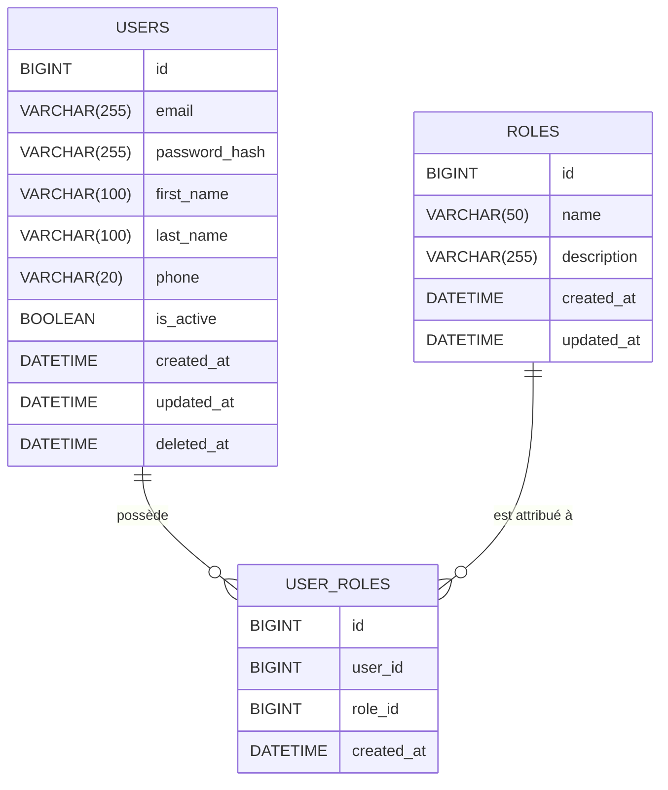

# Environnement de développement Docker avec Nestjs + MySQL + phpMyAdmin

## structure du projet

```txt
app/
│
├── src/
│   ├── app.controller.ts
│   ├── app.module.ts
│   └── main.ts
│
├── package.json
├── tsconfig.json
├── .env
├── Dockerfile.dev
├── docker-compose.yml
└── README.md

```

## Caractèristiques

- Nestjs avec hot reload
- MySQL préconfiguré
- phpMyAdmin pour visualiser la base

Code modifiable depuis VSCode sur votre machine

Prérequis :
- Docker Desktop installé
- VSCode conseillé mais autre éditeur de code OK

1. Démarrer tout l’environnement

Ouvre un terminal à la racine du projet :

```bash
docker compose up --build
```

## URL

| Service    | URL                                                        |
| ---------- | ---------------------------------------------------------- |
| API NestJS | [http://localhost:3000/hello](http://localhost:3000/hello) |
| phpMyAdmin | [http://localhost:8081](http://localhost:8083)             |
| MySQL      | localhost:3306                                             |


## Voir les informations dans la base de données (phpMyAdmin)

Lien : [http://localhost:8083](http://localhost:8083)

| Champ        | Valeur |
| ------------ | ------ |
| Serveur      | user-db     |
| Utilisateur  | db_user   |
| Mot de passe | db_user_password    |

La base `db_user_database` existe déjà.

## Le code du microservice

Tout le code de votre microservice doit se trouver dans le dossier `app/src/`

## Vérifier fonctionnement minimal microsevice

Cliquez ici : [http://localhost:3000/hello](http://localhost:3000/hello)

## Ajouter des dépednances au projet

Utiliser `npm install <nom du package>`

et relancer

```bash
docker compose up --build
```

## Réinitialiser la base de données

> Attention cette action est définitive

```bash
docker compose down -v
docker compose up
```

## Variables d'environnement

Le fichier `.env` sert à stocker toutes les informations sensibles et les paramètres de configuration de l’application en dehors du code.

### Changer facilement la configuration

Si vous voulez changer :
- le mot de passe MySQL
- le nom de la base
- l’environnement (development / production)
- l’URL d’une API externe

Modifiez juste le `.env`dans votre microservice, pas le code.


## Schéma de la Base de Données du UserService



## Script SQL

```sql
-- USE userservice;

-- =======================================
-- Table : users
-- =======================================
CREATE TABLE IF NOT EXISTS users (
    id BIGINT UNSIGNED AUTO_INCREMENT PRIMARY KEY,
    email VARCHAR(255) NOT NULL UNIQUE,
    password_hash VARCHAR(255) NOT NULL,
    first_name VARCHAR(100) NULL,
    last_name VARCHAR(100) NULL,
    phone VARCHAR(20) NULL,
    is_active TINYINT(1) NOT NULL DEFAULT 1,
    created_at DATETIME NOT NULL DEFAULT CURRENT_TIMESTAMP,
    updated_at DATETIME NOT NULL DEFAULT CURRENT_TIMESTAMP ON UPDATE CURRENT_TIMESTAMP,
    deleted_at DATETIME NULL
) ENGINE=InnoDB
  DEFAULT CHARSET = utf8mb4
  COLLATE = utf8mb4_unicode_ci;

-- =======================================
-- Table : roles
-- =======================================
CREATE TABLE IF NOT EXISTS roles (
    id BIGINT UNSIGNED AUTO_INCREMENT PRIMARY KEY,
    name VARCHAR(50) NOT NULL UNIQUE,
    description VARCHAR(255) NULL,
    created_at DATETIME NOT NULL DEFAULT CURRENT_TIMESTAMP,
    updated_at DATETIME NOT NULL DEFAULT CURRENT_TIMESTAMP ON UPDATE CURRENT_TIMESTAMP
) ENGINE=InnoDB
  DEFAULT CHARSET = utf8mb4
  COLLATE = utf8mb4_unicode_ci;

-- =======================================
-- Table : user_roles
-- (table de liaison N..N entre users et roles)
-- =======================================
CREATE TABLE IF NOT EXISTS user_roles (
    id BIGINT UNSIGNED AUTO_INCREMENT PRIMARY KEY,
    user_id BIGINT UNSIGNED NOT NULL,
    role_id BIGINT UNSIGNED NOT NULL,
    created_at DATETIME NOT NULL DEFAULT CURRENT_TIMESTAMP,

    -- Contraintes d'intégrité référentielle
    CONSTRAINT fk_user_roles_user
        FOREIGN KEY (user_id) REFERENCES users(id)
        ON DELETE CASCADE
        ON UPDATE CASCADE,

    CONSTRAINT fk_user_roles_role
        FOREIGN KEY (role_id) REFERENCES roles(id)
        ON DELETE CASCADE
        ON UPDATE CASCADE,

    -- Empêche d'attribuer deux fois le même rôle au même user
    CONSTRAINT uq_user_role UNIQUE (user_id, role_id)
) ENGINE=InnoDB
  DEFAULT CHARSET = utf8mb4
  COLLATE = utf8mb4_unicode_ci;

-- Index supplémentaires
CREATE INDEX idx_user_roles_user_id ON user_roles(user_id);
CREATE INDEX idx_user_roles_role_id ON user_roles(role_id);
```
