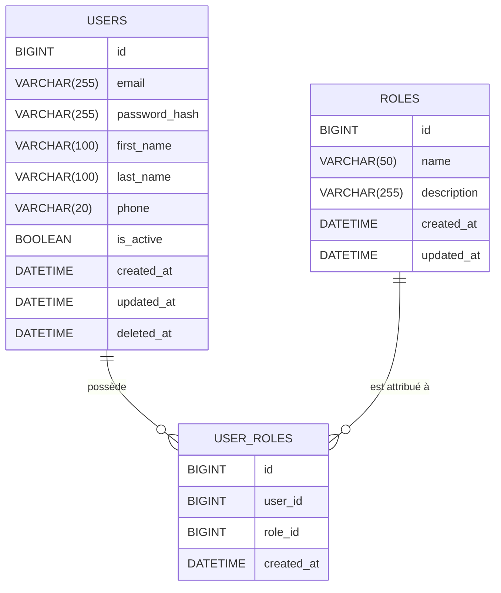

# Environnement de développement Docker avec Nestjs + MySQL + phpMyAdmin

## structure du projet

```txt
app/
│
├── src/
│   ├── app.controller.ts
│   ├── app.module.ts
│   └── main.ts
│
├── package.json
├── tsconfig.json
├── .env
├── Dockerfile.dev
├── docker-compose.yml
└── README.md

```

## Caractèristiques

- Nestjs avec hot reload
- MySQL préconfiguré
- phpMyAdmin pour visualiser la base

Code modifiable depuis VSCode sur votre machine

Prérequis :
- Docker Desktop installé
- VSCode conseillé mais autre éditeur de code OK

1. Démarrer tout l’environnement

Ouvre un terminal à la racine du projet :

```bash
docker compose up --build
```

## URL

| Service    | URL                                                        |
| ---------- | ---------------------------------------------------------- |
| API NestJS | [http://localhost:3000/hello](http://localhost:3000/hello) |
| phpMyAdmin | [http://localhost:8081](http://localhost:8083)             |
| MySQL      | localhost:3306                                             |


## Voir les informations dans la base de données (phpMyAdmin)

Lien : [http://localhost:8083](http://localhost:8083)

| Champ        | Valeur |
| ------------ | ------ |
| Serveur      | user-db     |
| Utilisateur  | user_db_user   |
| Mot de passe | user_password    |

La base `user_database` existe déjà.

## Le code du microservice

Tout le code de votre microservice doit se trouver dans le dossier `app/src/`

## Vérifier fonctionnement minimal microsevice

Cliquez ici : [http://localhost:3000/hello](http://localhost:3000/hello)

## Ajouter des dépednances au projet

Utiliser `npm install <nom du package>`

et relancer

```bash
docker compose up --build
```

## Réinitialiser la base de données

> Attention cette action est définitive

```bash
docker compose down -v
docker compose up
```

## Variables d'environnement

Le fichier `.env` sert à stocker toutes les informations sensibles et les paramètres de configuration de l’application en dehors du code.

### Changer facilement la configuration

Si vous voulez changer :
- le mot de passe MySQL
- le nom de la base
- l’environnement (development / production)
- l’URL d’une API externe

Modifiez juste le `.env`dans votre microservice, pas le code.


## Schéma de la Base de Données du UserService


